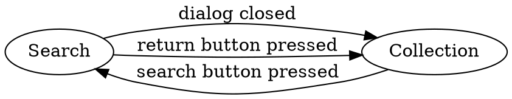

# Zotero for KOReader

## Developer documentation

### Zotero browser

This menu can be in two states:
* search result display
* collection display

```dot

digraph {
    rankdir="LR"
    Search -> Collection [label="dialog closed"];
    Search -> Collection [label="return button pressed"];

    Collection -> Search [label="search button pressed"];

}

```
